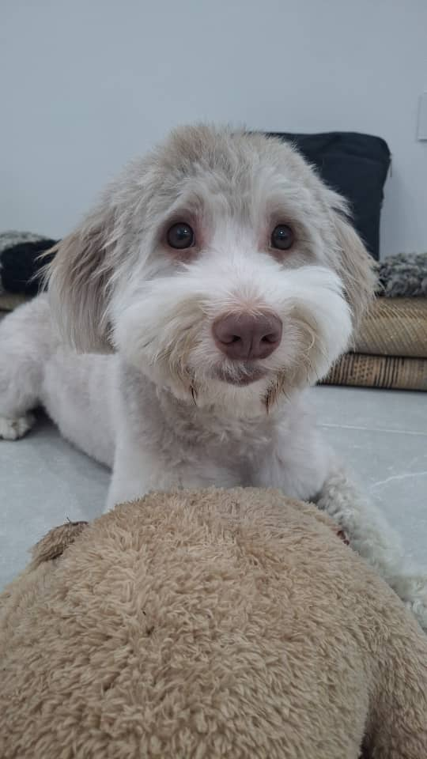

# Good Paw

Good Paw is a pet care web app built with Next.js that brings training, AI coaching, sitter discovery, and shopping into one friendly dashboard.

## Features (Short)

- Unified home hub to navigate Training, Sitter, AI Coaching, and Shop pages.
- Training library by dog stage (puppy, adolescent, rescue/anxious, senior) with practical behavior steps.
- AI step chat for follow-up guidance on specific training steps.
- AI personal training plan from uploaded behavior videos using Gemini.
- Interactive sitter discovery with map view, filters, and detailed sitter profiles.
- Merchandise section with branded pet products and image-based product cards.

## Tech Stack

- Next.js 16 + React 19 + TypeScript
- Tailwind CSS 4 + shadcn/ui components
- Leaflet + React Leaflet for map interactions
- Gemini API via @google/genai for AI features

## Quick Start

```bash
npm install
npm run dev
```

Open http://localhost:3000

## Mr. Milo

Reference image:


